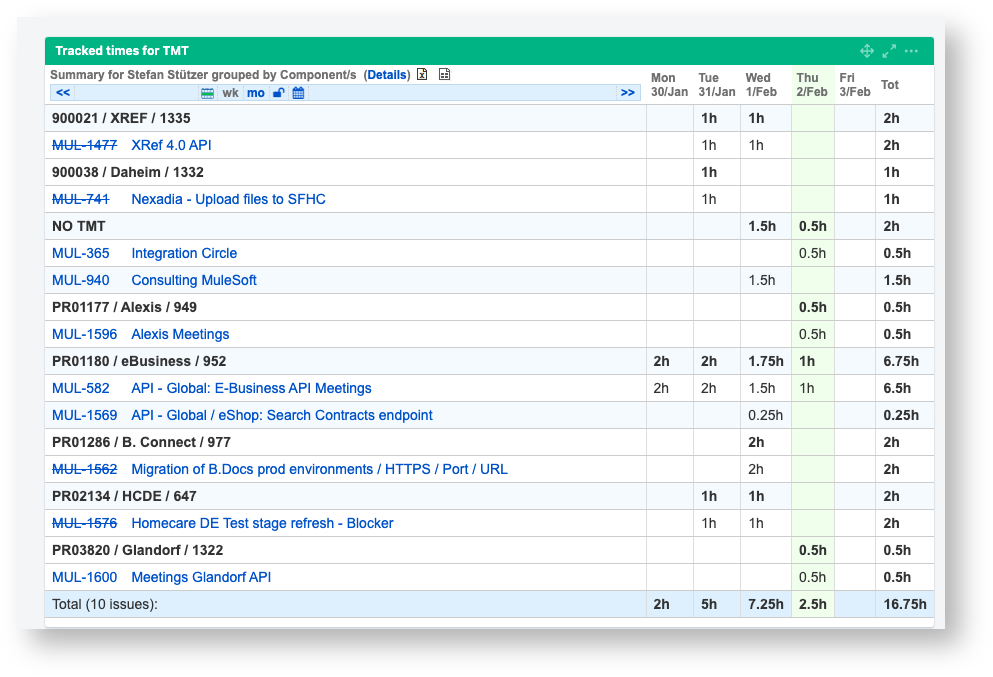

# Time Tracking
{: .no_toc }

Our work on API developments must be charged to the clients (internal departments). For this reason, it is important that we record our working hours correctly for all activities so that they can be charged to the correct cost centers.
{: .fs-6 .fw-300 }

<details open markdown="block">
  <summary>
    Table of contents
  </summary>
  {: .text-delta }
1. TOC
{:toc}
</details>


# Where to track times?
In order to charge the times they must be inside the time Tracking system [TmT](https://tmt.bbraun.cloud/activity/projects){:target="_blank"} (Track my Time). To be able to plan better and see if our estimates match the actual effort, it is useful to record the required working time directly in Jira on the task in addition to TmT.

## Jira
1. Open a task and select `More` → `Log Work`

1. Enter the spent time and a short description of the work (optionally)


Time bookings in Jira **do not trigger** a charge to the department. This is only for statistical purposes in order to be able to compare our estimate with the actual expenditure
{: .note }


## TmT (Track my Time)
Our **leading time tracking system** is TmT (Track My Time). 

1. You can access it here: [https://tmt.bbraun.cloud/activity/projects](https://tmt.bbraun.cloud/activity/projects){:target="_blank"}

1. Select a project and click the `+` button to create a new activity

1. Enter the hours of work and add the Jira ticket id as the activity description. Click the `save` button.


## How to identify the correct TmT project?

For mapping from a Jira ticket to the correct TmT booking project, we use **components**. Each Jira story a developer works on, needs to have a proper value in the component field. It has the following layout

```
<TmT Project ID> / <Short Project Name> / <Technical Project ID>
```

The technical Project ID is sometimes helpful, as the standard TmT id is not unique.


To simplify time trackings in TmT it's sufficient to perform it just **once a week** in an **aggregated manner**. In the [Jira Dashboard](https://jira.bbraun.com/secure/Dashboard.jspa){:target="_blank"}, you will find a table with all your recorded times, grouped by component, so you can transfer the aggregated value into TmT for each project.



**NO TMT** means that there is no business sponsor for that development. So you cannot track it in TmT (costs are covered by IT)
{: .highlight }

It is the responsibility of each team member to record their times in the TmT independently and without being asked to do so. Local supervisors in the line organisation may check whether the times have been booked.
{: .warning }

## PowerBi Report
The following [PowerBi report](https://app.powerbi.com/groups/me/reports/5afafe3a-3b6a-48e9-9c0a-b8be24801e17/ReportSection8cf1568393ee80a4cccc?ctid=15d1bef2-0a6a-46f9-be4c-023279325e51&openReportSource=ReportInvitation&experience=power-bi){:target="_blank"} can be used to check the correct booking in the TmT

## Automatic Jira / TmT Sync
**There is no automatic sync between Jira and TmT**. All times have to be manually tracked in TmT.

## Activities not related to a Jira story
In our daily work, we often perform project or API related activities for which we do not have an active story in the Sprint Backlog. These types of activities are

- Failing integration tests / Update tests with proper test data
- Meetings / Calls / E-Mail conversations
- Brainstorming session about something related to an API
- Wiki Documentation about an API
- Ad-Hoc activities as part of support / maintenance for an API / project

Those activities must also be tracked and charged to the project. As there is no story, please track the time on the related EPIC