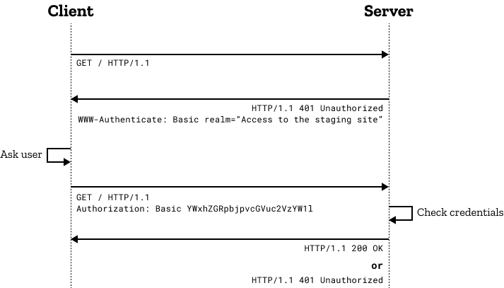

# Know-How Transfer

We regularly organise know-how transfer sessions in which one or more team members can share knowledge with the team. Below you will find the recordings of the previous sessions as well as a backlog of topics.
{: .fs-6 .fw-300 }

## 2024

| Date     | Topic                                                                          | Presented by                   | Resources                                                                                                                                                                                                                                                                                                                                                                                                                                                                                                                           |
|----------|--------------------------------------------------------------------------------|--------------------------------|-------------------------------------------------------------------------------------------------------------------------------------------------------------------------------------------------------------------------------------------------------------------------------------------------------------------------------------------------------------------------------------------------------------------------------------------------------------------------------------------------------------------------------------|
| Jun 28th | JPrime takeaways                                                               | Stiliyan Velislav           |                                                                                                                                                                                                                                                                                                                                                                                                                                                                                                                                     |
| Jun 4th  | Terraform / Azure                                                              | Kamil                          | [Recording](https://bbraun.sharepoint.com/:v:/r/sites/bbraun_eis_mulesoftit/TeamDocuments/Know-How-Transfer/2024-06-04_Terraform_Azure.mp4?csf=1&web=1&e=GOqO1y){:target="_blank"}                                                                                                                                                                                                                                                                                                                                                  |
| May 13th | New Documentation Framework                                                    | Stefan                         | [Markdown Table Generator](https://www.tablesgenerator.com/markdown_tables){:target="_blank"} [Recording](https://bbraun.sharepoint.com/:v:/r/sites/bbraun_eis_mulesoftit/TeamDocuments/Know-How-Transfer/2024-05-13_Docs.mp4?csf=1&web=1&e=h23r8V){:target="_blank"}                                                                                                                                                                                                                                                            |
| May 3rd  | Takeaways from [APICon 2024](https://apiconference.net/london/program-london/) | Stiliyan Velislav Stefan | [Recording](https://bbraun.sharepoint.com/:v:/r/sites/bbraun_eis_mulesoftit/TeamDocuments/Know-How-Transfer/2024-05-07_APICon.mp4?csf=1&web=1&e=EDmheX){:target="_blank"} [OWASP Top 10 API Security Risks](https://owasp.org/API-Security/editions/2023/en/0x11-t10/){:target="_blank"} [API Landscape](https://apilandscape.apiscene.io/){:target="_blank"} [spectral Linter](https://docs.stoplight.io/docs/spectral/674b27b261c3c-overview){:target="_blank"} [oasdiff](https://www.oasdiff.com/){:target="_blank"} |
| Apr 5th  | Basic auth flow (and why we don't Spring for that)                             | Velislav                       | [Recording](https://bbraun.sharepoint.com/:v:/r/sites/bbraun_eis_mulesoftit/TeamDocuments/Know-How-Transfer/2024-04-05-Basic-auth-spring.mp4?csf=1&web=1&e=U6oHAY){:target="_blank"}                                                                                                                                                                                                                                                                                                 |
| Mar 15th | Salesforce Developer tools (Workbench, Developer Console, Chrome Addon)        | Stefan                         | [Recording](https://bbraun.sharepoint.com/:v:/r/sites/bbraun_eis_mulesoftit/TeamDocuments/Know-How-Transfer/2024-03-15-Salesforce-Addon.mp4?csf=1&web=1&e=UdJvnV){:target="_blank"} [Chrome Addon](https://chromewebstore.google.com/detail/organizer-for-salesforce/lojdmgdchjcfnmkmodggbaafecagllnh){:target="_blank"} [Workbench](https://workbench.developerforce.com/login.php?startUrl=%2Fdescribe.php){:target="_blank"}                                                                                               |

## 2023

| Date     | Topic                                                                                                                            | Presented by | Resources                                                                                                                                                                                                                                                       |
|----------|----------------------------------------------------------------------------------------------------------------------------------|--------------|-----------------------------------------------------------------------------------------------------------------------------------------------------------------------------------------------------------------------------------------------------------------|
| Nov 17th | Jumphost Overview                                                                                                                | Kamil        | [Recording](https://bbraun.sharepoint.com/:v:/r/sites/bbraun_eis_mulesoftit/TeamDocuments/Know-How-Transfer/2023-11-17-Jumphost.mp4?csf=1&web=1&e=0ajMkD){:target="_blank"}                                                                                     |
| Oct 17th | MuleSoft Best Practice Checker Self-developed tool to automatically review best practices that we have agreed upon as a team. | Velislav     | [Recording](https://bbraun.sharepoint.com/:v:/r/sites/bbraun_eis_mulesoftit/TeamDocuments/Know-How-Transfer/2023-10-17-MBP-Checker.mp4?csf=1&web=1&e=0B458U){:target="_blank"}                                                                                  |
| Jul 27th | API Community Manager - Publish APIs                                                                                             | Stefan       | [Publish APIs to ACM](..) [Recording](https://bbraun.sharepoint.com/:v:/r/sites/bbraun_eis_mulesoftit/TeamDocuments/Know-How-Transfer/2023-07-27_Publish_to_ACM.mp4?csf=1&web=1&e=fooniZ){:target="_blank"}                                                  |
| Jul 19th | VSC DataWeave Extension How to install and use DataWeave extension for Visual Studio Code                                        | Michal       | [Recording](https://bbraun.sharepoint.com/:v:/r/sites/bbraun_eis_mulesoftit/TeamDocuments/Know-How-Transfer/2023-07-19_VSCodePlugin.mp4?csf=1&web=1&e=RDgal0){:target="_blank"}                                                                                 |
| Mar 31st | API Documentation in GitHub with Markdown and Mermaid                                                                            | Velislav     | [Recording](https://bbraun.sharepoint.com/:v:/r/sites/bbraun_eis_mulesoftit/TeamDocuments/Know-How-Transfer/2023-03-31_Markdown_Mermaid.mp4?csf=1&web=1&e=Kca0op){:target="_blank"}                                                                             |
| Mar 9th  | EA Knowledge Transfer - MuleSoft                                                                                                 | Eryk         | [Recording](https://bbraun.sharepoint.com/:v:/r/sites/bbraun_eis_mulesoftit/Public%20Documents/2023-03-09-MuleSoft-EA-ShareIT.mp4?csf=1&web=1&e=rNQ4eD){:target="_blank"}                                                                                       |
| Mar 6th  | DataWeave Multipart payloads                                                                                                     | Stiliyan     | [Recording](https://bbraun.sharepoint.com/:v:/r/sites/bbraun_eis_mulesoftit/TeamDocuments/Know-How-Transfer/2023-03-06_Multipart.mp4?csf=1&web=1&e=hSlKjq){:target="_blank"}                                                                                    |
| Jan 12th | Azure Onboarding                                                                                                                 | Moussa       | [Recording](https://bbraun.sharepoint.com/:v:/r/sites/bbraun_eis_mulesoftit/TeamDocuments/Know-How-Transfer/2023-01-12-Azure-Onboarding.mp4?csf=1&web=1&e=wBSahv){:target="_blank"} [Docs](https://docs.bbhc.bbraun.cloud/onboarding.html){:target="_blank"} |
| Jan 10th | GitHub Actions Migration from Jenkins to GitHub Actions Artifactory                                                              | Stefan       | [Recording](https://bbraun.sharepoint.com/:v:/r/sites/bbraun_eis_mulesoftit/TeamDocuments/Know-How-Transfer/2023-01-10-GitHub_Actions.mp4?csf=1&web=1&e=hiw26L){:target="_blank"}                                                                               |

## Older Sessions

{: .note }
You can still find the recordings of older sessions in our [SharePoint Space](https://bbraun.sharepoint.com/sites/bbraun_eis_mulesoftit/TeamDocuments/Forms/AllItems.aspx?id=%2Fsites%2Fbbraun%5Feis%5Fmulesoftit%2FTeamDocuments%2FKnow%2DHow%2DTransfer&viewid=8fe888d6%2D7eff%2D461d%2D9816%2D1d7aa8520ffb){:target="_blank"}
