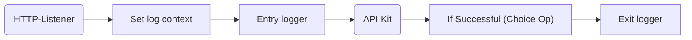

# Upgrade API Logging

## Dependencies

### bbraun-common-utils 2.0.0+

Update the pom dependency for the common utilities to version 2.0.2 or higher  

```xml
		<dependency>
			<groupId>com.bbraun.mulesoft</groupId>
			<artifactId>bbraun-common-utils</artifactId>
			<version>2.0.2</version>
			<classifier>mule-plugin</classifier>
		</dependency>
```

### dw-logging 1.2.1+

Update the pom dependency for the dw-logging module 

```xml
		<dependency>
			<groupId>cb729472-528f-4190-9f6f-01c272917b9e</groupId>
			<artifactId>dw-logging</artifactId>
			<version>1.2.1</version>
			<classifier>dw-library</classifier>
		</dependency>
```

## Cleanup

### Remove logging import

Remove the line below from global.xml and/or all xml files that contain it

```xml
    <import doc:name="logging-import" file="bbraun-common-logging.xml" doc:id="fb5ce1da-8c9d-4338-befd-e9a6b01d8081" />
```

### Remove Entry and Exit loggers

Remove all entry and exit loggers from the implementation flows.  
From now on, entry and exit loggers will be used only in the main flow (see below for details).

### Replace Process loggers 

Update the process loggers in the implementation flows.


XML:

```xml
<logger level="INFO" doc:name="Process Logger" doc:id="0" message="#[logging::processLogger(vars.logContext, "Some message as text or object")]" />
```

DW: 

```
logging::processLogger(vars.logContext, "Some message as text or object")
```


## Loggers and log context 




### Set the logContext variable

```
%dw 2.0
output application/json
import * from logging
---
initLogContext(
	correlationId,
	attributes,
	payload,
	authentication.properties.clientName default ""
)
```

### Entry logger

```
logging::entryLogger(vars.logContext)
```

### Choice operator for the exit logger

```
((vars.httpStatus default 200) < 300) and ((vars.httpStatus default 200) >= 200)
```

### Exit logger

```
logging::exitLogger(vars.logContext)
```

### Example main flow

```xml
<flow name="EXAMPLE MAIN FLOW" doc:id="0" >

    <ee:transform doc:name="Set logContext" doc:id="1">
        <ee:message />
        <ee:variables>
            <ee:set-variable resource="dwl/api-kit/set-log-context.dwl" variableName="logContext" />
        </ee:variables>
    </ee:transform>

    <logger level="INFO" doc:name="Entry Logger" doc:id="2" message="#[logging::entryLogger(vars.logContext)]" />

    <apikit:router config-ref="NB - REPLACE!!!" />

    <choice doc:name="OK?" doc:id="4" >
        <when expression="#[((vars.httpStatus default 200) &lt; 300) and ((vars.httpStatus default 200) &gt;= 200)]" >
            <logger level="INFO" doc:name="Exit Logger" doc:id="5" message="#[logging::exitLogger(vars.logContext)]" />
        </when>
    </choice>

</flow>
```
