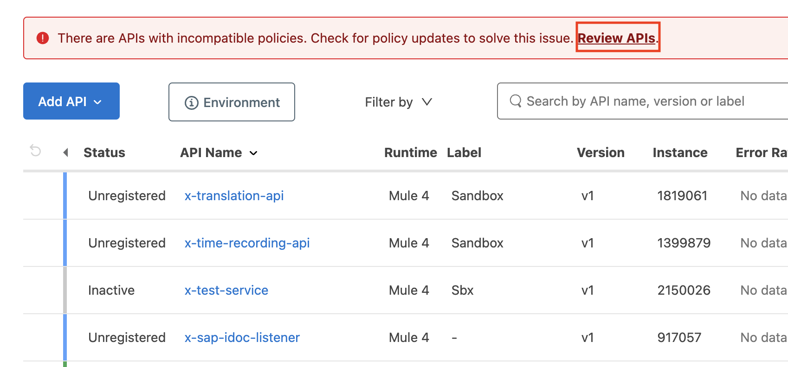

# API 4.6 Runtime Upgrade - Guide
{: .no_toc }

This guide will get you step by step to migrate an API to new 4.6 runtime with migration to Java 17. This guide will focus only on APIs (migration of custom connectors to Java 17) will not be covered here. 
{: .fs-6 .fw-300 }

<details open markdown="block">
  <summary>
    Table of contents
  </summary>
  {: .text-delta }
1. TOC
{:toc}
</details>

## Upgrade MuleSoft API project
First, get yourself familiar with the following articles:

* [Mule Runtime 4.6 Release Notes](https://docs.mulesoft.com/release-notes/mule-runtime/mule-4.6.0-release-notes){:target="_blank"}
* [Mule Runtime Upgrade Walkthrough](https://medium.com/another-integration-blog/navigating-the-ins-and-outs-of-upgrading-from-mule-4-4-to-4-6-a-comprehensive-guide-c1f74754400b){:target="_blank"}

1. After you’ve read them you’re ready to perform the migration. When you’ve chosen an API to migrate clone it to your machines. In order to open the and API using runtime 4.6 and Java 17 you need to update your Anypoint Studio to at least version 7.17. Then you need to import cloned project.

{: .highlight }
There might be a prompt shown notifying you that the project was previously opened using old version of Anypoint Studio and the project needs to be update. If that’s the case click “Perform Update”.

{:style="counter-reset:none"}
1. After you successfully imported the project we can start with upgrading process.

1. First, go to pom file and edit cloudHubDeployment properties. Add these 3 fields:

```xml
<muleVersion>4.6-java17</muleVersion>
<releaseChannel>LTS</releaseChannel>
<javaVersion>17</javaVersion>
```

{:style="counter-reset:none"}
1. After that you’ll need to update all connectors to newest version so they’ll be able to support java 17.


1. After successfuly upgrading all modules to the newest version you can debug the API. In order to debug the API with Java 17 ensure that it’s correctly set in your debug configuration.

1. During starting the API look at the logs and see if there are any issues after upgrading the API. If some of the connector will crash because of lack of support for Java 17 they’re going to be marked in logs with the following message:


1. After solving possible compatibility issues with the connectors and testing the API you’re ready to deploy it to cloud hub. To make sure that a correct version of Runtime is deployed edit the deployment configuration file in your API project with correct runtime version:


1. If the all of the runtime properties are correctly set it is possible that the API is still down due to outdated policies which do not support Java 17. You can identify them by taking a look in the logs where you will be able to see these kind of messages:


1. In order to fix these go to API manager and update the policies in API manager to the newest version.



1. After all of these steps are done restart the API and it should be up and running.

## Upgrade API Proxy
1. Upgrade Policies: See this [Guide](https://docs.mulesoft.com/general/upgrade-policies-proxies#upgrading-included-api-level-policies){:target="_blank"}
1. Upgrade Proxy: See this [Guide](https://docs.mulesoft.com/general/upgrade-policies-proxies#cloudhub-and-cloudhub2-deployments){:target="_blank"}