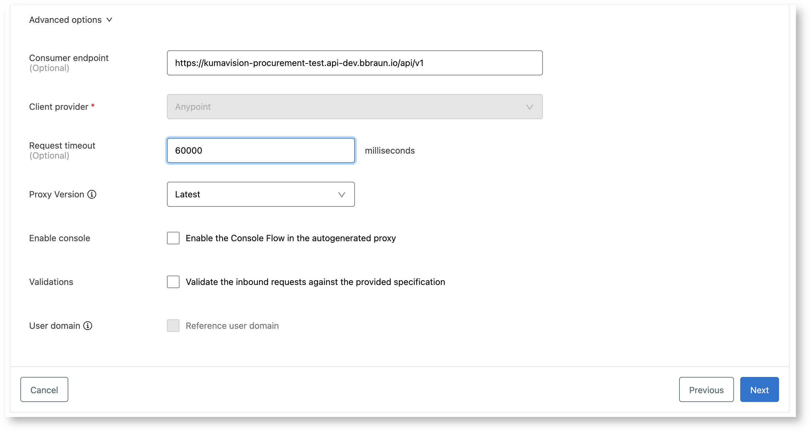
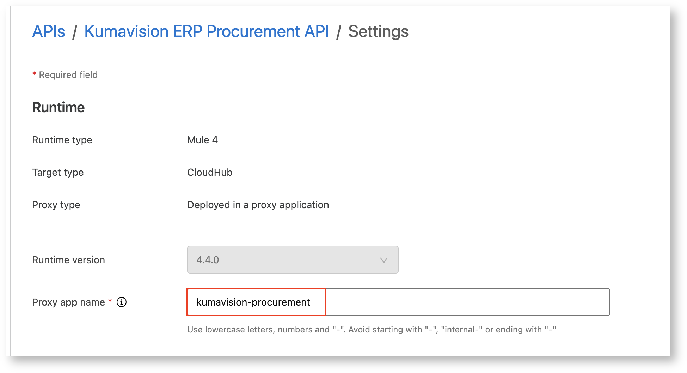
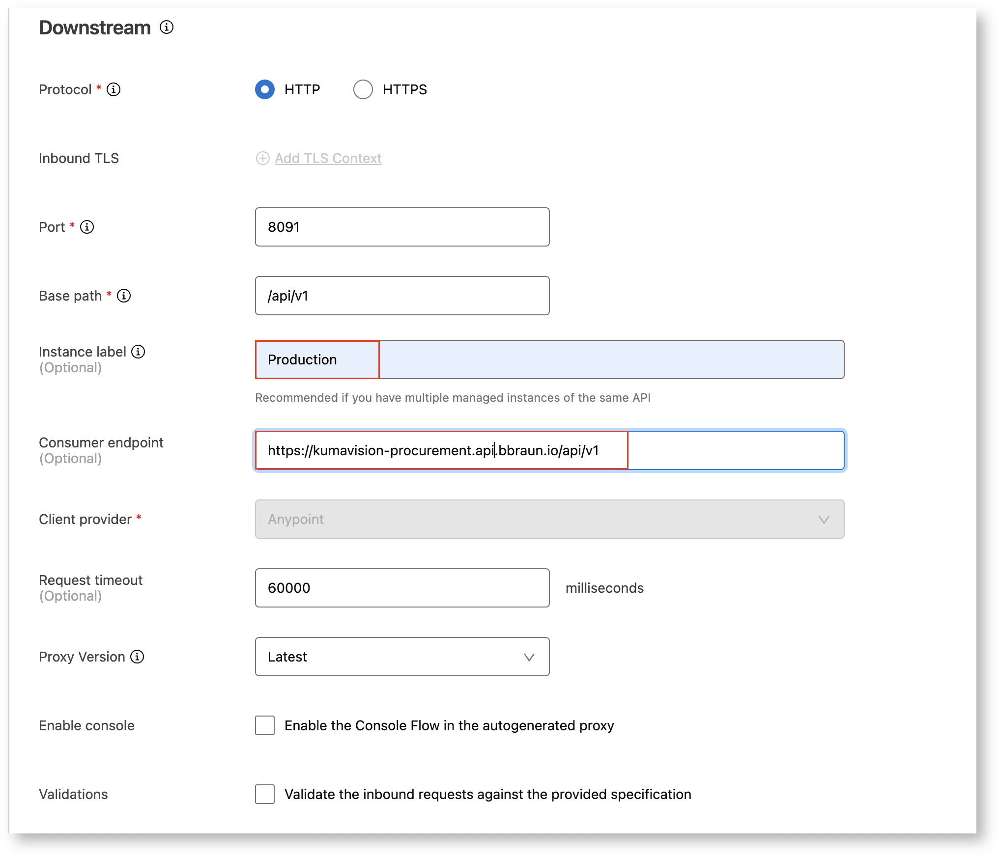

# API Proxies
{: .no_toc }

This article describes how to set up and update a MuleSoft Proxy API.
{: .fs-6 .fw-300 }

<details open markdown="block">
  <summary>
    Table of contents
  </summary>
  {: .text-delta }
1. TOC
{:toc}
</details>

This article assumes that connectivity already exists between the MuleSoft CloudHub environment and the target service we want to proxy. If thats not the case a FWRCR must be raised in advance.
{: .note}

## Deploy API Proxy
### API specification
The owner of the API of the target system has to provide a specification of the endpoints to expose in **OAS format**.

1. Create a private repository for the OAS project in our GitHub space. Use the following [template](https://code.bbraun.io/IT-BS-MuleSoft/x-template-api-oas){:target="_blank"} by clicking `Use this template`. The project name should follow the naming pattern `x-<api-name>-api-oas`.
1. Add "MuleSoft Global" in repo settings *Collaborators and teams*
1. Assign `oas` as repository topic
1. Put the OAS API specification povided by the vendor in the file `API.yaml`or `API.json`
1. Commit to `develop` branch and run linting process on *Actions* tab by calling the workflow `Run Linting and publish OAS` with *spectral* option
1. Fix all findings or alternatively return the OAS file to the provider with a request for fixing
1. Create Pull Request towards `master` and assign an approver
1. Run linting and publishing process on *Actions* tab by calling the workflow `Run Linting and publish OAS` with *spectral* and *publish* option.
1. After publishing the Asset gets created in Anypoint Exchange.

### Configure and Deploy Proxy
1. Configuration of the proxy must be done in [API Manager](https://eu1.anypoint.mulesoft.com/apimanager/b-braun/#/organizations/cb729472-528f-4190-9f6f-01c272917b9e/environments/26d0bb50-4b78-4622-9a3a-0c66e6d8b07b/apis){:target="_blank"}. Select *TEST* as stage and select "Add new API"

1. Select *Mule Gateway* as Runtime
1. Select *Deploy proxy application* as proxy type

1. Select "CloudHub" as target type (CloudHub 2.0 is not yet configured properly)
1. Enter a name of the proxy app. This will be the part of the URL to access the proxy later (use suffix "-test" as we configure the proxy for test stage in that step")

1. Search for the Exchange asset that belongs to the proxy (asset we published in step 1)


1. Keep Default settings and click *Next*
	1. Select "HTTP" as protocol
	1. Enter "8091" as port so proxy gets exposed via Dedicated load balancer
	1. Enter `/api/v1` as base path
	1. Enter "Test" as Instance label as this is visible in the "Request Access" dialog as stage label
	1. Expand "Advanced options"
	
	1. Enter the consumer endpoint under which the proxy will be available at this stage (https://<proxy name>-test.api-dev.bbraun.io/api/v1)
	1. Enter a proper request timeout (e.g. 60000) 
	1. Click *Next*
	
	1. Enter the Upstream URL (URL of the backend service to proxy) 
	1. Click *Next*
	
1. Review all the settings and click *Save & Deploy*
1. API gets deployed to Runtime Manager

### Apply Policies
The following policies should be added to any proxy API on MuleSoft
- Client ID Enforcement
- Message Logging
- Rate Limiting

1. Open Policies on the API Asset in API Manager
1. Click *Add policy* and select "Client ID Enforcement"
1. Use default settings and click *Apply*
1. Click again *Add Policy* and select "Message Logging"
1. Add the following messages
	1. Before Calling 
	```bash
	#[{"logger": "Entry", "requestUri":attributes.requestUri default "","headers": attributes.headers default "" -- ["authorization", "client_secret"], "queryParams": attributes.queryParams default "", "client": authentication.properties.clientName default ""}]
	```
	1. After Calling 
	```bash
	#[{"logger": "Exit", "httpStatus": attributes.statusCode default "200", "reasonPhrase": attributes.reasonPhrase default "", "client": authentication.properties.clientName default ""}]
	```
1. Click again *Add Policy* and select "Rate Limiting"
	1. Add identifier ```#[attributes.headers.client_id default attributes.remoteAddress]```
	1. Set Limit to "1000 per 1 Minute"

### Add SLA
1. Click on *SLA Tiers* in the Asset in [API Manager](https://eu1.anypoint.mulesoft.com/apimanager/b-braun/#/organizations/cb729472-528f-4190-9f6f-01c272917b9e/environments/26d0bb50-4b78-4622-9a3a-0c66e6d8b07b/apis){:target="_blank"}
1. Click *Add SLA tier*
1. Enter 
	1. "Free" as Name
	1. "Manual" as Approval
	1. "1000 per 1 Minute" as Limit
and click "Add"

### Promote API Proxy to Production stage
1. Switch to "Production" stage in [API Manager](https://eu1.anypoint.mulesoft.com/apimanager/b-braun/#/organizations/cb729472-528f-4190-9f6f-01c272917b9e/environments/26d0bb50-4b78-4622-9a3a-0c66e6d8b07b/apis){:target="_blank"}
1. Click "*Add API" and select "Promote API from environment"
1. Select "Test" as Source Environment
1. Select the API created on Test stage as "API"
1. Select also Policies and SLAs so they are copied to Production stage as well
1. Click *Promote*

1. Click on the pencil button to edit Proxy configuration
	1. In the "Runtime" section set the productive app name (same as on Test stage without "-test" suffix)
	
	1. In the "Downstream" section 
		1. Set instance label to "Production"
		1. Change the Consumer endpoint to `https://<proxy name>.api.bbraun.io/api/v1`
		
		1. In the "Upstream" section set the URL to the productive backend system to proxy
		1. Click *Save & Deploy*
		1. Proxy API gets deployed to Runtime Manager Production
		

## Update API Proxy
In case the backend systems has changes in the API an updated RAML document will be provided to us.

### Update API specification 
1. Replace the file in oas GitHub repository
1. Commit to `develop` branch and run linting process on *Actions* tab by calling the workflow `Run Linting and publish OAS` with *spectral* option
1. Fix all findings or alternatively return the OAS file to the provider with a request for fixing
1. Create Pull Request towards `master` and assign an approver
1. After merge run linting and publishing process on *Actions* tab by calling the workflow `Run Linting and publish OAS` with *spectral* and *publish* option.
1. After publishing the Asset gets created in Anypoint Exchange.1. After publishing the Asset gets created in Anypoint Exchange.

### Redeploy proxy
1. Open [API Manager](https://eu1.anypoint.mulesoft.com/apimanager/b-braun/#/organizations/cb729472-528f-4190-9f6f-01c272917b9e/environments/26d0bb50-4b78-4622-9a3a-0c66e6d8b07b/apis){:target="_blank"}
1. Select the "Test" stage 
1. Select the API Proxy Asset
1. In the "Actions" menu select "Change API specification"
1. Select the latest version (the one published before) and click "Change" 


1. Click the pencil icon
1. Scroll down to bottom of page and click *Save & Apply*
1. The API gets redeployed with the new API specification (check the status of the deployment in Runtime Manager)
1. Repeat the process for "Production" stage.

Sometimes the changes are not applied directly, meaning a new endpoint cannot be called and the API responds with "Resource not found". In that case restart the API Proxy in Runtime Manager again.
{: .warning}

{:style="counter-reset:none"}
1. Run integration tests for the Proxy API for each stage