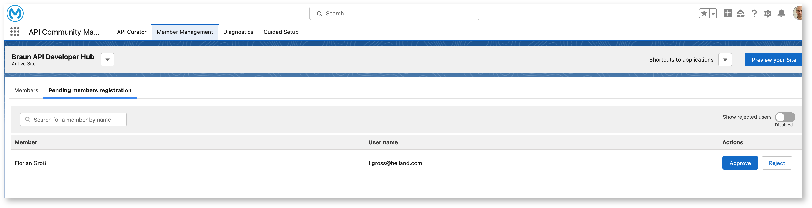
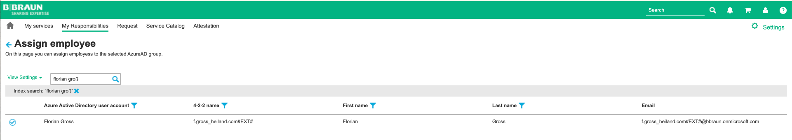
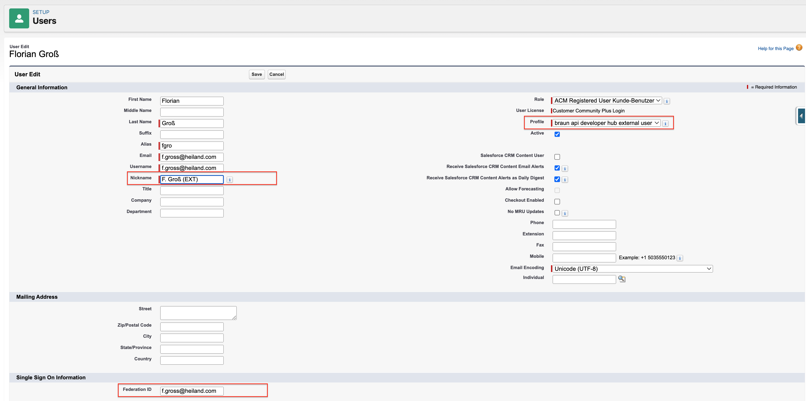

# External User - ACM Registration Request

## Support Case
If an external user (not a B. Braun employee) wants to access the protected part of the API Community Manager he needs
1. Be invited via [Navoo](https://guestuser.navoo.com/){:target="_blank"} by business responsible person for that external user (not by us)
1. Request access via the [Self Registration Form](https://developer.api.bbraun.io/s/login/SelfRegister){:target="_blank"}.

## Support Trigger
Notification with subject **User Registration Request** in Teams [Support Channel](https://teams.microsoft.com/l/channel/19%3A778981db271d491ebbb38d6639ed5428%40thread.tacv2/08_Support?groupId=2512783f-0f9a-44c4-9370-85d63ddf131b&tenantId=15d1bef2-0a6a-46f9-be4c-023279325e51){:target="_blank"}.

## Support Process
To activate access to the ACM the following steps must be performed

1. Check User details about requesting user in [ACM Admin](https://bbraunmelsungenag.lightning.force.com/lightning/n/acm_pkg__ManageMembers){:target="_blank"} `Member Management` → `Pending members registration` 

Do not click `Approve` in this step! See step 4
{: .warning } 

{:style="counter-reset:none"}
1. Add User to AAD group inside [MyID](https://myid.intranet.bbraun.com/){:target="_blank"}
    1. Select `My Responsibility` → `Manage Groups`
    1. Select **AAD_EA_MulesoftACM_StandardUser**
    1. Click `Assign Memberships`
    1. Search for user by email address and click `Assign`

{:style="counter-reset:none"}
1. Wait for about **30 minutes** (thats needed because Azure and MyID need to sync, otherwise SSO login will not work for new user)
1. Approve Request in `Member Management` → `Pending members registration`  by clicking `Approve`.
    1. User will be active and profile can be opened in `Setup` → `Users`
    1. User will receive a "Welcome email" 

When approving user fails, check in `Setup` → `Users` if the user exists. Then continue with step 5 to maintain federation id and nickname.
{: .highlight }

{:style="counter-reset:none"}
1. Open the user in `Setup` → `User`
    1. Set E-Mail address as `Federation ID` in ACM User Profile
    1. Set Nickname to `<first letter of firstname> <lastname> (EXT)`
    1. Set Profile to `braun api developer hub external user`
    1. Click `Save`

{:style="counter-reset:none"}
1. Add user to Group **External Developers**
    1. In Setup, search for "Public Groups"
    1. Click `Edit` on "External Developers"
    1. Select "Customer Portal Users"
    1. Search for the user and click `Add` and `Save`

