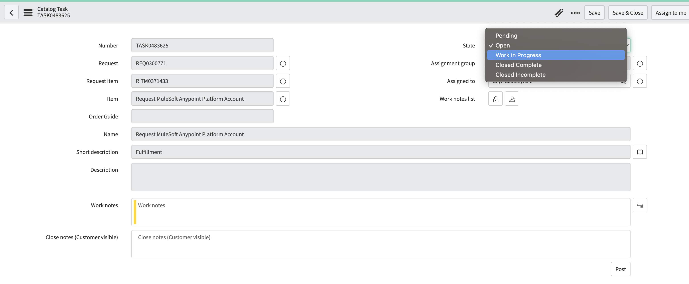
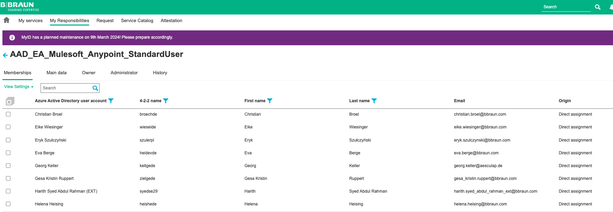

# Anypoint Platform Role Assignment Request

## Support Case
A user needs a special role in Anypoint platform (like Monitoring Viewer). He needs to request that role in [Service Now](https://bbraunp.service-now.com/serviceportal?id=sc_cat_item&sys_id=9cb90fd0db339090ae6330d6f49619a6){:target="_blank"}.

## Support Trigger
E-Mail about requested role with Subject **IT Shop Task TASKXYZ -- Assigned to your team**

## Support Process
1. Check if the user is known and authorized to get the desired access (if in doubt, ask the team) 
1. Open ServiceNow Task and assign it to you and set it to `Work  In Progress`

1. Assign the User to the desired team in Anypoint Platform (Access Management > [Teams](https://eu1.anypoint.mulesoft.com/accounts/teams){:target="_blank"})
1. Assign the user to the Azure AD Group **AAD_EA_Mulesoft_Anypoint_StandardUser** in MyID

1. Set ServiceNow ticket to Status `Closed Complete`