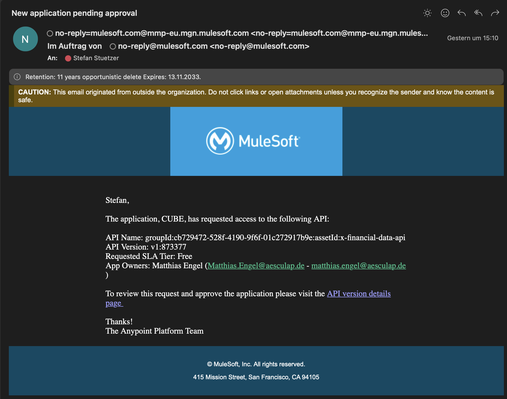

# API Access Requests

## Support Case
 A User registers a client in the API market place and requests access to an API for that client.

## Support Trigger
E-Mail about new pending registration request with subject **New application pending approval**.

## Support Process
The process of approving these types of API access requests is **performed by the API owners**. For example, each access request to the Product API must be processed by Christian Broel. Our teams responsibility is to support API Owners and notify them in case they perform no action. (Currently, not every API owner is notified via eMail about a pending request)

1. Check who is API owner
1. Notify API owner about access request
1. Some API owners approve / reject on their own in API Manager. Some need support and ask us to do this action on behalf of them. In last case we would approve the pending contract in API Manager