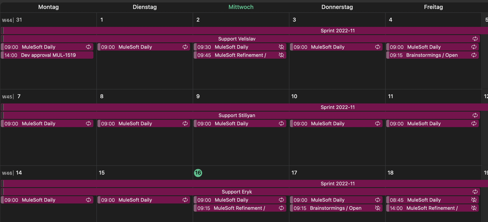
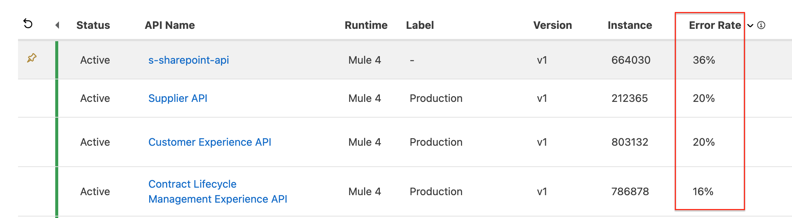

# Support

All about Support for the MuleSoft platform and ecosystem as well support for APIs developed by the B. Braun MuleSoft team.
{: .fs-6 .fw-300 }

Chapter Responsible: tbd.
{: .note }

## Salesforce / MuleSoft Support
Support requests to MuleSoft can be made in the [Salesforce Help Portal](https://help.salesforce.com/s/support){:target="_blank"}. 

## Project Support
The project support is a shared role within the MuleSoft Scrum team. Every week this responsibility switches inside the team according to the plan scheduled in Shared MuleSoft Outlook calendar.

### Responsibilities
The supporter **is responsible** for completing the following tasks during the week of service:

- **Daily** check of the status of the APIs
    - Check [Power Bi Dashboard](https://app.powerbi.com/groups/160574ba-b011-4d64-abe3-b167d45ac973/reports/976b77fb-5931-4a04-b2aa-a44dcb1d9928/ReportSection?experience=power-bi){:target="_blank"} for failed tests, high error rates, enabled debug logs on PRD, pending access requests
    - Check failing Integration test in [Test overview page](https://pages.code.bbraun.io/IT-BS-MuleSoft/integration-test-overview-page/){:target="_blank"}
    - Check API error rate on PRD environment in [API Manager](https://eu1.anypoint.mulesoft.com/apimanager/b-braun/#/organizations/cb729472-528f-4190-9f6f-01c272917b9e/environments/26d0bb50-4b78-4622-9a3a-0c66e6d8b07b/apis){:target="_blank"}. (Check detailed logs in the event of an unusually high error rate)
    
    - Check Policy violations in [Monitoring Dashboard](https://eu1.anypoint.mulesoft.com/monitoring/#/dashboard/rate-limiting-policy-violations-production){:target="_blank"}
- Verification of availability and functionality of APIs in case of failed integration tests: [Integration Test Support](./integration-test-support)
- Check [Monitoring](https://teams.microsoft.com/l/channel/19%3A4fb566a7d4a54af19ab6f0b0e98ff85d%40thread.tacv2/07_Monitoring?groupId=2512783f-0f9a-44c4-9370-85d63ddf131b&tenantId=15d1bef2-0a6a-46f9-be4c-023279325e51){:target="_blank"} messages in Teams
    - Custom notifications from APIs
    - API gets unresponsive → Check API. Restart, assign proper vCores or add additional workers
    - Status of VPN tunnel → Check with Hafiz/Kamil or open a ServiceNow ticket if PRD tunnel is down 
    - Expiring certificates → Check with Hafiz/Kamil and/or create a Jira ticket for certificate renewal
- Verification and processing of ACM user registration requests: 
    - [Internal User - ACM Registration Request](./acm-internal-registration)
    - [External User - ACM Registration Request](./acm-external-registration)
- Support on API Access Requests to API Owners: [API Access Requests](./api-access-requests)
- Verification and processing of ServiceNow tickets assigned to our assignment group
    - New role requests for Anypoint Platform: [Anypoint Platform Role Assignment Request](./ap-role-assignment)
    - A Support ticket opened in Service Now → Check ticket and create a proper jira story for it

