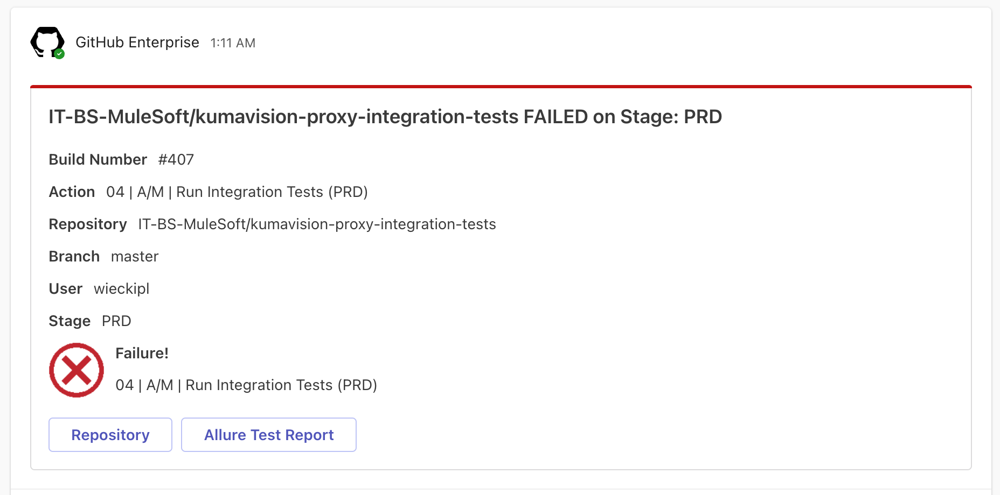

# Integration Tests
An overview of all integration test projects and their current status can be found here: [Integration Test Overview Page](https://pages.code.bbraun.io/IT-BS-MuleSoft/integration-test-overview-page/){:target="_blank"}
{: .highlight }

## Support Case
Plenty of our MuleSoft APIs are covered by Integration Tests. Once a test is failing we have to check if a real problem caused this error or a temporary issue or false-negative test. 

## Support Trigger
All failing test runs will be reported in the Teams Channel [MuleSoft / Integration Test Results](https://teams.microsoft.com/l/channel/19%3A2f7890feb48546a396193d9c932bfc82%40thread.tacv2/06_Integration%20Test%20Results?groupId=2512783f-0f9a-44c4-9370-85d63ddf131b&tenantId=15d1bef2-0a6a-46f9-be4c-023279325e51){:target="_blank"}.

## Support Process
1. Check the Allure report (A link to it is contained in the notification)

1. Check the root cause of the failing test
    1. ***Option 1***: Fix root cause. If a misbehaviour of the API itself causes this issue create a Jira ticket. Please notify the team in the channel that you found the root cause.
    1. ***Option 2***: Root cause not on MuleSoft side.	If the root cause is a other system or a temporary infrastructure issue, also notify the team about your findings. The teams decides about the next steps (create Service Now ticket, notify other teams etc.)