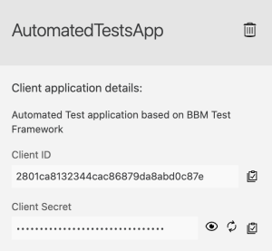
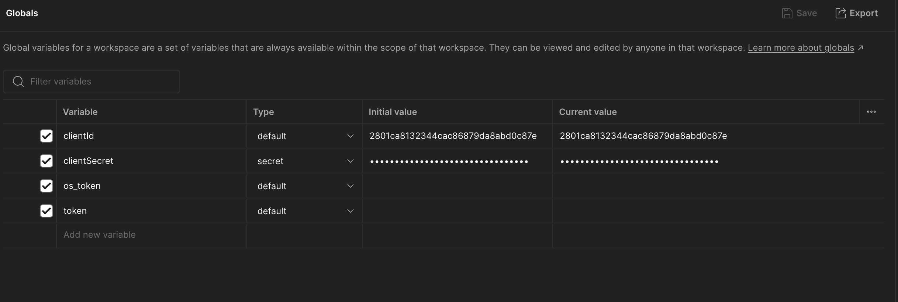
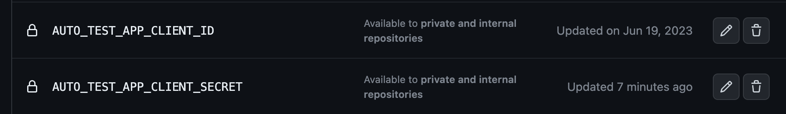
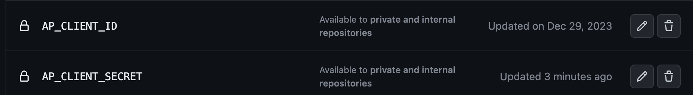

# Renew AutomatedTestApp credentials

## Support Case
For security reasons, the `client_secret` of the AutomatedTestApp should be renewed peridically, as it has access to all APIs.

## Support Trigger
Renew once a quarter.

## Support Process
1. Go to [API Manager](https://eu1.anypoint.mulesoft.com/apimanager/b-braun/#/organizations/cb729472-528f-4190-9f6f-01c272917b9e/environments/26d0bb50-4b78-4622-9a3a-0c66e6d8b07b/apis){:target="_blank"} and renew credentials for AutomatedTestApp client application

Do not renew credentials for other client applications, only the main one **AutomatedTestApp**
{: .warning}

{:style="counter-reset:none"}
1. Update new client secret in KeePass
1. Update Postman Globals in workspace ***MuleSoft - General***

1. Update [GitHub Secrets](https://code.bbraun.io/organizations/IT-BS-MuleSoft/settings/secrets/actions){:target="_blank"}

1. Update credentials in PowerBI Dashboard with Danuta