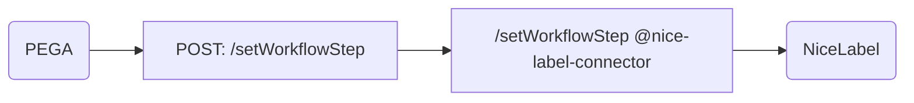
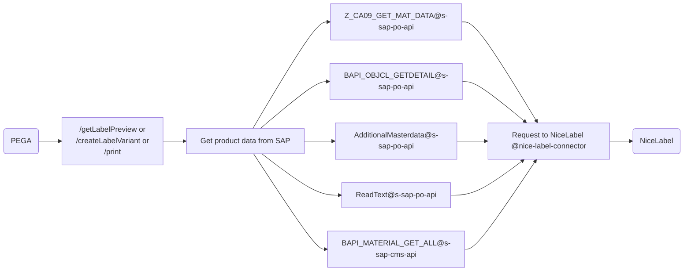
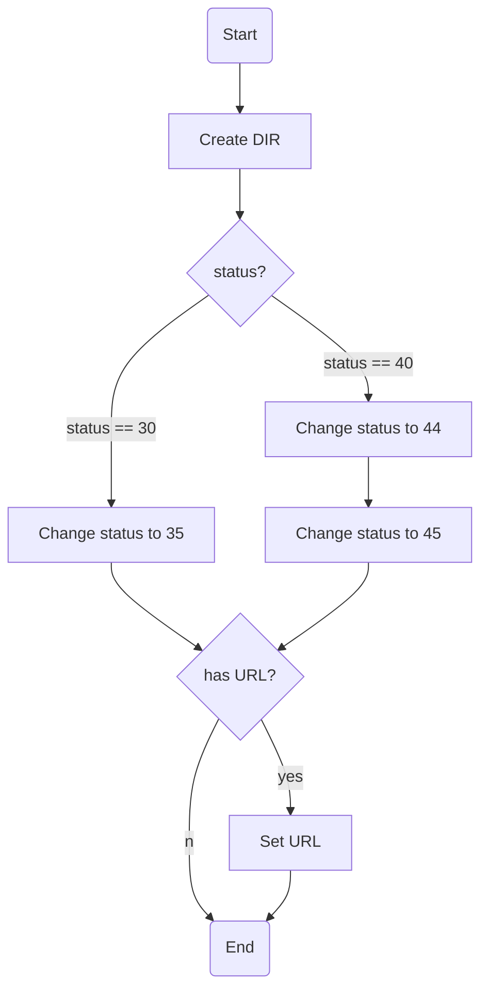
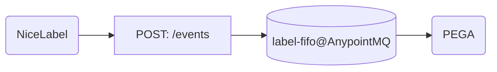

# Label API

[Design Center](https://eu1.anypoint.mulesoft.com/designcenter/designer/#/project/ba9dcdea-cb62-4aa8-bcfc-47fe060a3035)  
[Exchange](https://eu1.anypoint.mulesoft.com/exchange/cb729472-528f-4190-9f6f-01c272917b9e/x-label)  
[ACM](https://developer.api.bbraun.io/s/communityapi/a020900000OBKehAAH/braun-api-developer-hublabelapi)    
[Jira Epic](https://jira.bbraun.com/browse/MUL-238)  
[Integration tests](https://code.bbraun.io/IT-BS-MuleSoft/x-label-api-integration-test)  
[User guide for extending the classification mapping in SharePoint](https://bbraun.sharepoint.com/:w:/r/sites/PEMIT/BLING%20-%20Process%20Design/_layouts/15/Doc.aspx?sourcedoc=%7B9A334B6B-440D-4992-A22B-681FFAF360E1%7D&file=BLING_HowToIncludeNewVariables.docx&wdLOR=c9DDF403D-DD97-3B49-8DC0-6771AD575200&action=default&mobileredirect=true)

## Endpoints

### POST: /setWorkflowStep Set workflow step

### POST: /getLabelPreview 
### POST: /createLabelVariant 
### POST: /print 

### POST: /documentCreate Document Info Record (DIR) creation

### POST: /events Label notification event

